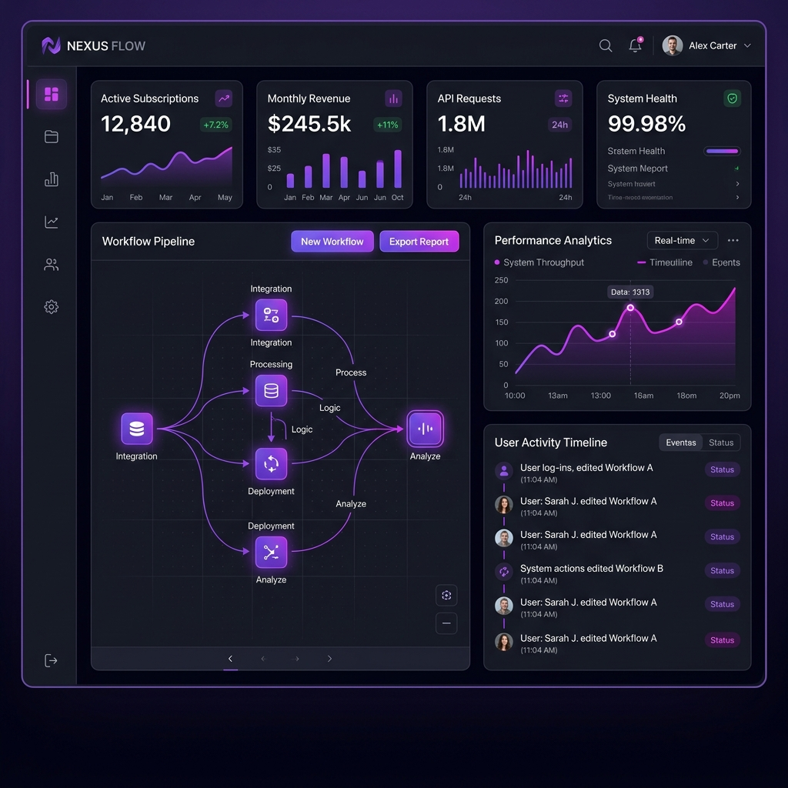

# NovaAI — SaaS Landing Page Template for Vercel

A modern, high-converting, responsive SaaS landing page static website template built with Vanilla HTML5, CSS3 (Custom Design System, Glassmorphism, CSS Grid), and modular JavaScript.

Designed specifically for zero-config hosting on **Vercel**.



## ✨ Features

- **Futuristic Dark-Mode Aesthetic**: Radiant gradient glow effects, glassmorphism cards, micro-animations, typography powered by *Plus Jakarta Sans* & *JetBrains Mono*.
- **Interactive Component Suites**:
  - 🔄 **Monthly / Annual Billing Toggle** with smooth price transitions & discount badges.
  - 🤖 **Platform Showcase Tabs** (Prompt Chains, Visual Canvas, Live Analytics, REST API).
  - ❓ **FAQ Accordions** with expand/collapse states.
  - 🚀 **Lead Capture Modal Dialog** with simulated instant account creation feedback.
  - 📱 **Mobile Drawer Navigation** with responsive hamburger menu toggle.
- **Vercel Optimized**: Included `vercel.json` with clean URLs, security headers, and static asset cache headers.

## 🚀 How to Deploy on Vercel

### Option 1: Via Vercel CLI (Recommended & Fastest)

1. Install Vercel CLI if you haven't already:
   ```bash
   npm i -g vercel
   ```

2. Run the deployment command in the root directory:
   ```bash
   vercel
   ```

3. Follow the CLI prompts to deploy directly to production:
   ```bash
   vercel --prod
   ```

---

### Option 2: Via GitHub & Vercel Dashboard

1. Push this repository to GitHub, GitLab, or Bitbucket.
2. Log into your [Vercel Dashboard](https://vercel.com/dashboard).
3. Click **"Add New Project"** -> **"Import Git Repository"**.
4. Select this repository. Vercel will automatically detect it as a **Other / Static Site**.
5. Click **"Deploy"**. Your site will be live in under 15 seconds!

---

## 💻 Local Preview & Development

You can preview the website locally using any static web server:

```bash
# Using npx serve
npx serve .

# Or using Python's built-in HTTP server
python -m http.server 8000
```

Open `http://localhost:3000` (or `http://localhost:8000`) in your browser.

## 📁 File Structure

```text
├── assets/
│   └── hero-dashboard.png    # Visual UI preview asset
├── index.html                # Semantic HTML structure & SEO tags
├── styles.css                # CSS design system, dark mode & animations
├── script.js                # Interactivity, pricing toggle & modals
├── vercel.json               # Vercel deployment configuration
├── package.json              # Optional local serve scripts
└── README.md                 # Documentation & deployment guide
```

## 📄 License

MIT License — Free to customize for personal and commercial projects.
